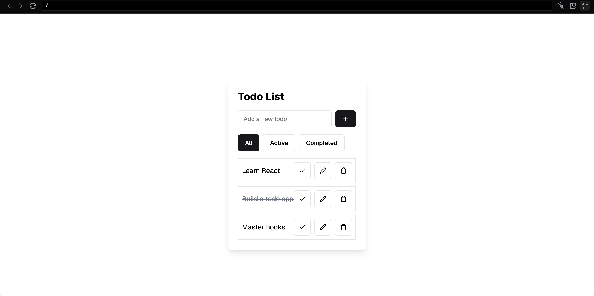

# Todo List Application Requirements

You are tasked with creating a simple todo list api using Node, TypeScript, Express, Postgres, and your chosen ORM. This API would be intended to serve as the backend for the following frontend



A Todo from a user's perspective is comprised of the following

- name
- completed at (optionally set)
- created at
- modified at

## Getting Started

No matter what ORM you chose, you will need a local postgres database and most likely an IDE to view your database. Make sure you have docker installed and running locally. Then you should be able to run the following

```shell
docker compose up -d
```

which will spin up a postgres db at localhost:6543 and pg admin at [localhost:8080](localhost:8080) (pg admin username: admin@example.com, pg admin password: admin, db password: admin).

Next, copy `.env.example` to a new `.env` file so that database environment variables can be read by your application.

```shell
cp .env.example .env
```

Once you have the db running in the background and environment variables copied, you can start the app by first installing all node dependencies

```shell
npm install
```

and then starting the app in dev mode with hot reload

```shell
npm run dev
```

Your application's Express routes are defined in [./src/index.ts](./src/index.ts).

Your application's DB connection is defined in [./src/db/index.ts](./src/db/index.ts).

Your schema is defined in [./src/db/schema.prisma](./src/db/schema.prisma).

You can apply schema changes to your existing db by running

```shell
npm run db:push
```

## Core Requirements

1. Create a new todo
2. Read a single todo
3. List all todos
4. Update a todo
5. Delete a todo
6. Implement proper error handling (with express) and input validation (with zod)
7. All endpoints should follow RESTful conventions

## Bonus Features (if time allows)

8. Add the ability to filter todos by whether they were completed or not
9. Add the ability to categorize todos
10. Add the ability filter todos by category
11. Implement pagination for the todo list endpoint
